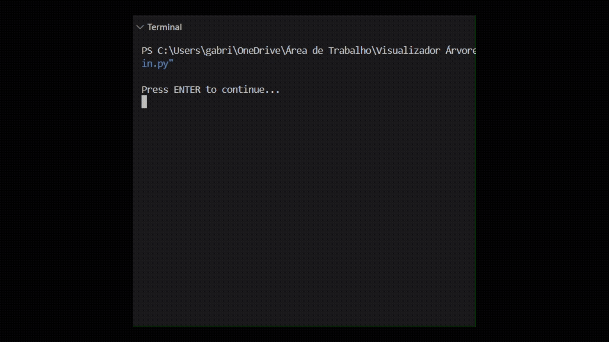

[🇧🇷 Português](./README.pt-BR.md) | [🇬🇧 English](./README.md)

<p align="center">
  
  
</p>

<p align="center">
  <a href="#-about-the-project">About</a>&nbsp;&nbsp;&nbsp;|&nbsp;&nbsp;&nbsp;
  <a href="#-features">Features</a>&nbsp;&nbsp;&nbsp;|&nbsp;&nbsp;&nbsp;
  <a href="#-concepts-demonstrated">Concepts</a>&nbsp;&nbsp;&nbsp;|&nbsp;&nbsp;&nbsp;
  <a href="#-project-structure">Structure</a>&nbsp;&nbsp;&nbsp;|&nbsp;&nbsp;&nbsp;
  <a href="#-technologies-used">Technologies</a>&nbsp;&nbsp;&nbsp;|&nbsp;&nbsp;&nbsp;
  <a href="#-how-to-run">How to run</a>&nbsp;&nbsp;&nbsp;|&nbsp;&nbsp;&nbsp;
  <a href="#-license">License</a>
</p>

<p align="center">
  
</p>

# 🌳 Tree-verse: Interactive Binary Tree Learning Tool

## 📖 About the project

**Tree-verse** is an educational application developed in Python to teach the fundamentals of the **tree data structure** through an interactive and visual experience.

Through interactive lessons, node-by-node animations, and dynamic terminal visualizations, the project aims to transform theoretical data structure concepts into a practical learning experience.

> 🚧 **Project under development**
>
> Tree-verse is still under development. New features, lessons, and visual resources will be added as the project evolves.

---

## ⚙️ Features

- Insert elements into a Binary Search Tree
- Search for elements
- Remove nodes
- Pre-order, in-order, and post-order traversals
- Level-order traversal
- Calculate tree height
- Count nodes and leaves
- Visualize the tree structure in the terminal
- Interactive lessons about tree concepts

---

## 💡 Concepts Demonstrated

* **Binary Search Tree (BST):** A hierarchical data structure where each node has at most two children, organized so that values in the left subtree are smaller and values in the right subtree are greater than the parent node.
* **Tree Traversals:** Animations and visualizations demonstrating classic traversal strategies, including pre-order, in-order, post-order, and level-order (breadth-first) traversal.
* **Theoretical Foundations:** An approach to the fundamental concepts that define trees, such as:
  * **Nodes and leaves**
  * **Forests and subtrees**
  * **Binary trees**
  * **Minimum and maximum height**
  * **Length and depth**
  * **Binary Search Trees (BST)**

---

## 🏗️ Project Structure

To maintain separation of responsibilities, the application is organized into different modules:

* **`main.py`**: Application entry point, responsible for starting the program.
* **`app.py`**: Main orchestrator responsible for managing the execution flow of the system's features.
* **`src/classes.py`**: Contains the class responsible for creating nodes and the base binary tree structure, along with its traversal methods.
* **`src/tree.py`**: Dedicated to the search tree structures used by the system, currently containing the **Binary Search Tree (BST)** implementation.
* **`src/visualizer.py`**: Responsible for rendering trees and traversals in the terminal, including their animations.
* **`src/lessons.py`**: Learning module responsible for the lessons and explanations related to tree concepts.
* **`src/menu.py`**: Responsible for displaying menus and handling the options selected by the user.
* **`src/queue.py`**: Custom implementation of the **queue** data structure, used to support level-order traversal.
* **`src/utils.py`**: Contains utility functions such as numeric option input validation and terminal clearing.
* **`requirements.txt`**: Manages the external dependencies used by the project, such as `rich`, `pytest` and `graphviz`.
* **`tests/*`**: Directory intended for testing the project's features.

---

## 🛠️ Technologies Used

- **Python 3.8+**
- **Rich** — terminal rendering and styling
- **Pytest** — automated testing
- **Graphviz** — displaying the structure in image format
- **Git** — version control

---

## 🚧 Development

The project is currently under development, and new features will be added as the study and implementation progress.

### Implemented

- [x] Binary tree structure
- [x] Binary Search Tree (BST)
- [x] Element insertion
- [x] Element search
- [x] Node removal
- [x] Pre-order, in-order, and post-order traversals
- [x] Level-order traversal
- [x] Height calculation
- [x] Node counting
- [x] Leaf counting
- [x] Queue structure to support level-order traversal
- [x] Initial menu system
- [x] Initial lesson structure

### Next Steps

- [ ] Complete the interactive lessons
- [ ] Complete and improve the animated visualizations
- [ ] Expand test coverage
- [ ] Improve the terminal interaction experience
- [ ] Study and evaluate a future **AVL Tree** implementation

> The implementation of an **AVL Tree** is not part of the current scope. It will be studied at a later stage before any decision is made about implementing it in the project.

---

## 🚀 How to Run

### 1. Clone the repository

```bash
git clone https://github.com/gabbrielbf/tree-verse.git
cd tree-verse
